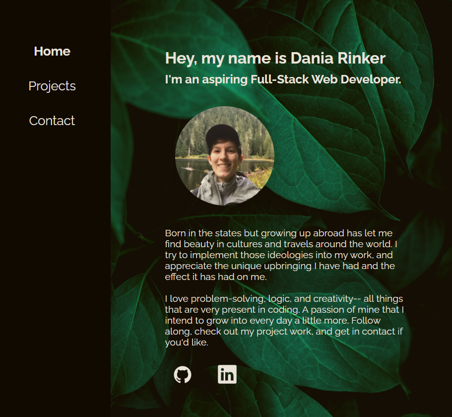

<div align="center" id="top"> 
  

&#xa0;

</div>

<h1 align="center">Dania S Rinker Portfolio React</h1>

<p align="center">
  

  

  

  
</p>

<!-- Status -->

<!-- <h4 align="center">
	🚧  Dsr Portfolio React 🚀 Under construction...  🚧
</h4>

<hr> -->

<p align="center">
  <a href="#dart-about">About</a> &#xa0; | &#xa0;
  <a href="#checkered_flag-starting">Starting</a> &#xa0; | &#xa0;
  <a href="#memo-license">License</a> &#xa0; | &#xa0;
  <a href="https://github.com/daniarinker" target="_blank">Author</a>
</p>

<br>

## :dart: About

This is my first take on my React Portfolio. It includes a resume, contact information and links, photos, and projects in the past that I have worked on. It currently contains other works featured on my Github account such as 'the Gifd of Food', 'Pan-dammit', and the assignment 'Password Generator'

## :rocket: Technologies

The following tools were used in this project:

- [Node.js](https://nodejs.org/en/)
- [React](https://pt-br.reactjs.org/)
- [React Native](https://reactnative.dev/)

## :checkered_flag: Starting

```bash
# Clone this project
$ git clone https://github.com/daniarinker/dsr-portfolio-react

# Access
$ cd dsr-portfolio-react

# Install dependencies
$ npm i

# Run the project
$ npm start

```

## :memo: License

This project is under license from MIT. For more details, see the [LICENSE](LICENSE.md) file.

Made with :heart: by <a href="https://github.com/daniarinker" target="_blank">Dania Rinker</a>

&#xa0;

<a href="#top">Back to top</a>
